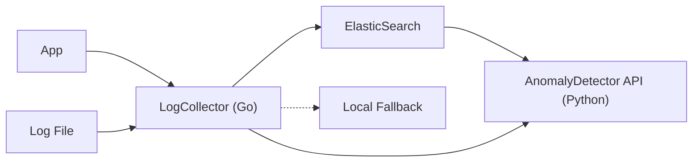

# Log Sentinel

Monitoramento inteligente de logs com detecção de anomalias baseada em machine learning.

---

## Visão Geral

O Log Sentinel é uma solução para ingestão, armazenamento e análise de logs, com detecção de anomalias baseada em machine learning. O pipeline é composto por:

- **LogCollector (Go):** recebe logs via HTTP e arquivos locais, envia para ElasticSearch ou salva localmente.
- **ElasticSearch:** armazenamento e consulta eficiente dos logs.
- **AnomalyDetector API (Python):** detecta anomalias nos logs usando ML, exposto via REST.

---

## Arquitetura



**Componentes:**

- **App:** Origem dos logs (serviços, aplicações)
- **Log File:** Arquivos locais de log
- **LogCollector (Go):** Coleta logs via HTTP e arquivos locais, envia para ElasticSearch, consulta serviço de ML
- **ElasticSearch:** Armazenamento e consulta
- **Local Fallback:** Armazenamento local caso ElasticSearch esteja indisponível
- **AnomalyDetector API (Python):** Detecção de anomalias via REST/gRPC

---

## Tech Stack

- Go (coletor e pipeline de ingestão)
- Python (scikit-learn para ML)
- FastAPI (serviço REST de ML)
- gRPC ou REST (comunicação entre Go e Python)
- ElasticSearch (armazenamento e consulta de logs)

---

## Estrutura do Repositório

- `cmd/collector` — Serviço Go para coleta de logs
- `cmd/ml` — Serviço Python para detecção de anomalias
- `pkg/anomaly` — Lógica de detecção de anomalias em Go
- `internal/parser` — Parsing e normalização de logs
- `infra/elastic` — Scripts/configuração do ElasticSearch
- `docs/` — Documentação e diagramas

---

## Configuração do LogCollector

1. Copie o arquivo `.env.sample` para `.env` e ajuste as variáveis conforme necessário:

```env
# Endereço do ElasticSearch (padrão: http://localhost:9200)
ELASTIC_ADDR=http://localhost:9200

# Nome do índice no ElasticSearch (padrão: logs-sentinel)
ELASTIC_INDEX=logs-sentinel

# Diretório monitorado para arquivos locais de log (padrão: /var/log/log_sentinel)
LOG_SENTINEL_DIR=/var/log/log_sentinel
```

---

## Como Executar o LogCollector

```sh
cd cmd/collector
# Exporte as variáveis de ambiente ou use um gerenciador de env (ex: direnv, dotenv)
go run main.go
```

O serviço ficará disponível em `http://localhost:8080/logs` para receber logs via POST.

---

## Serviço de ML (AnomalyDetector API)

### Instalação e Execução

```sh
cd cmd/ml
pip install -r requirements.txt
uvicorn main:app --host 0.0.0.0 --port 8000 --reload
```

### Treinamento do Modelo

Envie logs reais e simulados para o endpoint `/train`:

```sh
curl -X POST http://localhost:8000/train \
  -H 'Content-Type: application/json' \
  -d '[
    {"timestamp": "2024-06-01T12:00:00Z", "level": "INFO", "message": "User login", "source": "auth"},
    {"timestamp": "2024-06-01T12:01:00Z", "level": "ERROR", "message": "Brute force detected", "source": "auth"}
  ]'
```

### Predição de Anomalia

Envie um log para o endpoint `/predict`:

```sh
curl -X POST http://localhost:8000/predict \
  -H 'Content-Type: application/json' \
  -d '{
    "timestamp": "2024-06-01T12:05:00Z",
    "level": "ERROR",
    "message": "Multiple failed logins",
    "source": "auth"
  }'
```

Resposta:

```json
{
  "anomaly_score": 0.42,
  "is_anomaly": true
}
```

---

## Observações

- O serviço de ML utiliza Isolation Forest e pode ser treinado via API.
- O modelo é salvo em disco e recarregado automaticamente.
- O endpoint `/predict` retorna score e flag de anomalia.
- Integração com Go pode ser feita via requisições HTTP para o serviço Python.
- Teste o modelo com logs reais e simulando ataques (ex: brute force, spikes).

---
