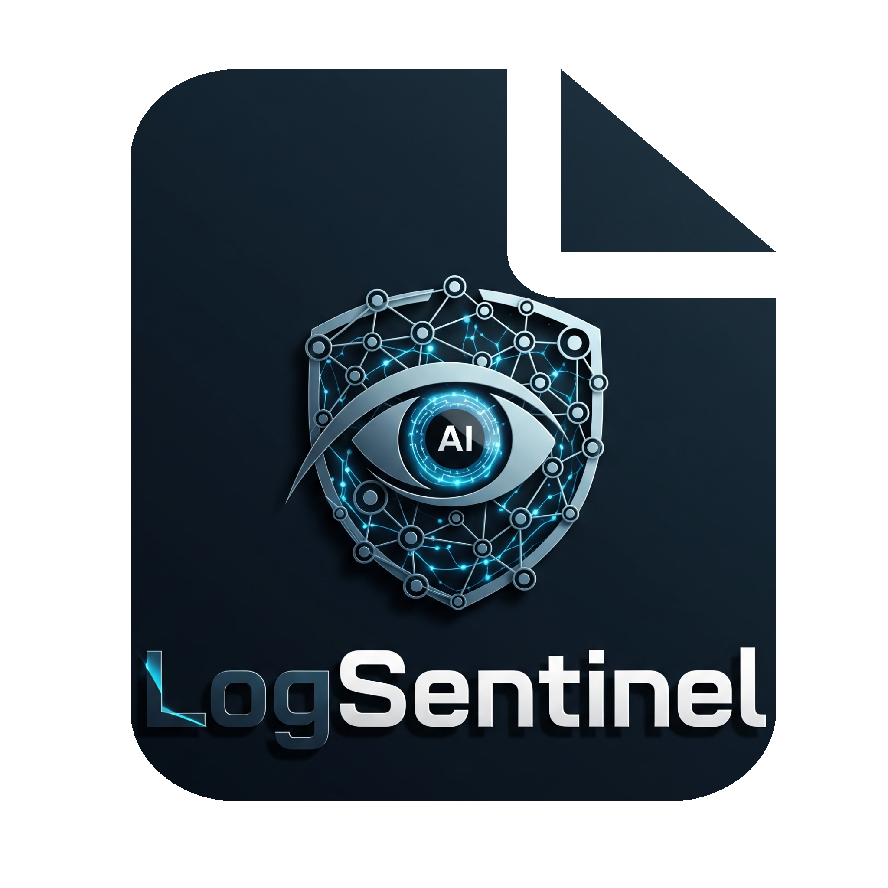
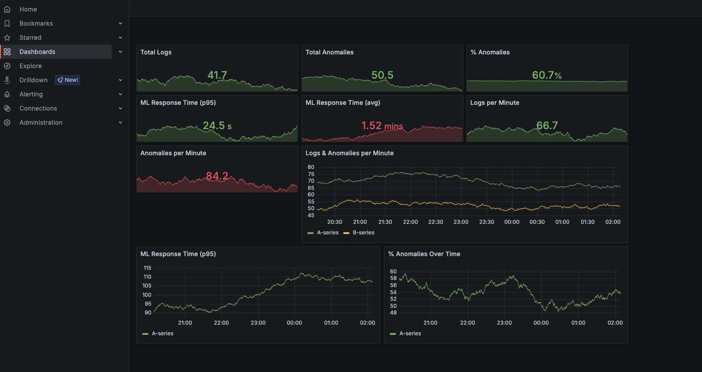
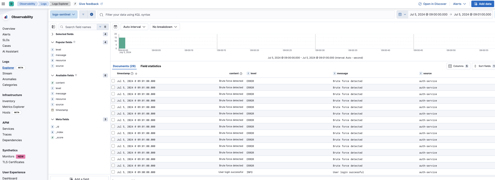
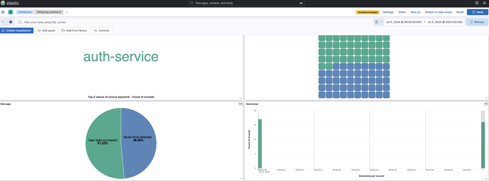
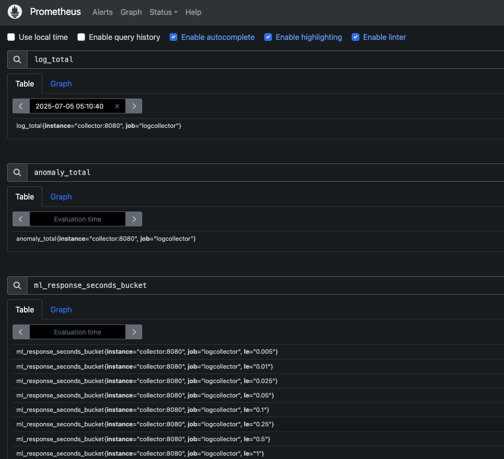
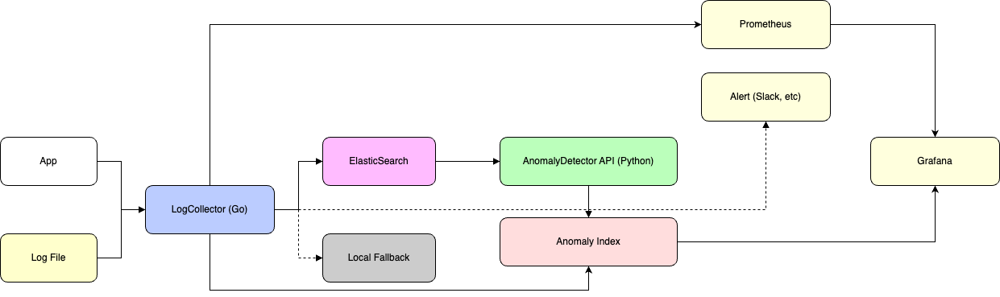

# 🛡️ Log Sentinel - Observabilidade & Anomalias em Logs

<div align="center">


<div data-badges>
  
  
  
</div>

<div data-badges>
  
  
  
  
  
  
  
</div>
</div>

O **Log Sentinel** é uma plataforma de observabilidade e detecção de anomalias em logs, combinando ingestão de logs, machine learning, ElasticSearch, Prometheus e Grafana para monitoramento inteligente e reação automática a incidentes.

✔ **Ingestão de logs multi-fonte** (HTTP, arquivos)

✔ **Detecção de anomalias** em tempo real via ML (Isolation Forest)

✔ **Alertas automáticos** em caso de picos de anomalia

✔ **Observabilidade completa** com Prometheus e Grafana

✔ **Dashboards ricos** para logs, anomalias, métricas e latência

✔ **Fallback local** e rastreabilidade ponta-a-ponta

Desenvolvido em Go e Python, pronto para produção, extensível e fácil de integrar.

---

## 🖥️ Como rodar este projeto 🖥️

### Requisitos:

- [Go 1.21+](https://golang.org/doc/install)
- [Python 3.10+](https://www.python.org/)
- [Docker & Docker Compose](https://docs.docker.com/get-docker/)

### Execução:

1. Clone este repositório:
   ```sh
   git clone https://github.com/lorenaziviani/log_sentinel.git
   cd log_sentinel
   ```
2. Instale dependências Go e Python:
   ```sh
   cd cmd/collector && go mod download
   cd ../ml && pip install -r requirements.txt
   ```
3. Configure variáveis de ambiente:
   ```sh
   cp .env.sample .env
   # Edite .env conforme necessário
   ```
4. Suba todos os serviços com Docker Compose:
   ```sh
   docker-compose up -d
   ```
5. Ou execute localmente:
   ```sh
   # ElasticSearch e Kibana via Docker
   docker-compose up -d elasticsearch kibana
   # ML
   cd cmd/ml && uvicorn main:app --host 0.0.0.0 --port 8000
   # Coletor
   cd ../collector && go run main.go
   ```
6. Envie logs de teste:
   ```sh
   make integration-test
   # ou
   bash ../logs-test.sh
   ```
7. Acesse os serviços:
   - **Kibana**: [http://localhost:5601](http://localhost:5601)
   - **Grafana**: [http://localhost:3000](http://localhost:3000)
   - **Prometheus**: [http://localhost:9090](http://localhost:9090)
   - **ML API**: [http://localhost:8000/docs](http://localhost:8000/docs)

---

## 🗒️ Features do projeto 🗒️

🔎 **Ingestão & Parsing**

- Recebe logs via HTTP e arquivos locais
- Parsing centralizado e normalização de campos
- Suporte a múltiplas fontes e formatos

🤖 **Detecção de Anomalias (ML)**

- Serviço Python com Isolation Forest
- Treinamento e predição via API REST
- Score de anomalia e classificação em tempo real

🚨 **Alertas & Reação**

- Geração automática de alertas (`level: ALERT`) em caso de picos de anomalia
- Persistência de alertas e logs anômalos em índices dedicados
- Pronto para integração com sistemas externos (Slack, e-mail)

📊 **Observabilidade Completa**

- Métricas Prometheus: volume, anomalias, latência do ML
- Dashboards Grafana: volume, % anomalia, tempo de resposta, alertas
- Dashboards Kibana: logs, anomalias, rastreabilidade

🛠️ **Administração & Testes**

- Makefile com targets para testes, lint, execução e integração
- Script de integração real (`logs-test.sh`)
- Fallback local automático se ElasticSearch indisponível

---

## 🔧 Comandos de Teste 🔧

```bash
# Testes unitários
make test

# Lint
make lint

# Executar o coletor
make run

# Teste de integração (envia logs reais)
make integration-test
```

---

## 📈 Monitoramento e Dashboards 📈

### Grafana Dashboard

Acesse [http://localhost:3000](http://localhost:3000) para visualizar:

- Volume de logs
- % de anomalias
- Latência do ML
- Alertas em tempo real



### Kibana

Acesse [http://localhost:5601](http://localhost:5601) para:

- Explorar logs e anomalias
- Criar dashboards customizados
- Rastrear logs do recebimento à classificação




### Prometheus Metrics

Acesse [http://localhost:9090](http://localhost:9090) para monitorar:

- Métricas em tempo real do Log Sentinel (coletor, ML, anomalias)
- Targets e endpoints monitorados (serviços Go, ML, etc)
- Queries customizadas para análise de volume de logs, latência do ML, % de anomalias
- Alertas e regras configuradas para detecção de picos, falhas ou anomalias



---

## 🏗️ Arquitetura do Sistema 🏗️



**Fluxo detalhado:**

1. Recebe log (HTTP ou arquivo)
2. Salva no ElasticSearch (ou local)
3. Consulta ML para detecção de anomalia
4. Salva anomalias e alertas em índices dedicados
5. Exposição de métricas Prometheus
6. Dashboards em Grafana e Kibana

---

## 💎 Links úteis 💎

- [Go Documentation](https://golang.org/doc/)
- [FastAPI](https://fastapi.tiangolo.com/)
- [ElasticSearch](https://www.elastic.co/guide/en/elasticsearch/reference/current/index.html)
- [Prometheus](https://prometheus.io/docs/)
- [Grafana](https://grafana.com/docs/)
- [Scikit-learn Isolation Forest](https://scikit-learn.org/stable/modules/generated/sklearn.ensemble.IsolationForest.html)

---
