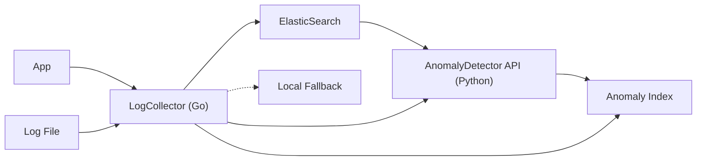

# Log Sentinel

Monitoramento inteligente de logs com detecção de anomalias baseada em machine learning.

---

## Visão Geral

O Log Sentinel é uma solução para ingestão, detecção e reação a anomalias em logs. O pipeline é composto por:

- **LogCollector (Go):** recebe logs, envia para ElasticSearch, consulta serviço de ML e sinaliza anomalias.
- **ElasticSearch:** armazenamento dos logs e das anomalias.
- **AnomalyDetector API (Python):** detecta anomalias nos logs usando ML, exposto via REST.

---

## Arquitetura



**Componentes:**

- **App:** Origem dos logs (serviços, aplicações)
- **Log File:** Arquivos locais de log
- **LogCollector (Go):** Coleta logs, envia para ElasticSearch, consulta serviço de ML, grava anomalias em outro índice
- **ElasticSearch:** Armazenamento e consulta
- **Local Fallback:** Armazenamento local caso ElasticSearch esteja indisponível
- **AnomalyDetector API (Python):** Detecção de anomalias via REST/gRPC
- **Anomaly Index:** Índice dedicado para logs anômalos

---

## Tech Stack

- Go (coletor e pipeline de ingestão)
- Python (scikit-learn para ML)
- FastAPI (serviço REST de ML)
- gRPC ou REST (comunicação entre Go e Python)
- ElasticSearch (armazenamento e consulta de logs)

---

## Estrutura do Repositório

- `cmd/collector` — Serviço Go para coleta de logs
- `cmd/ml` — Serviço Python para detecção de anomalias
- `pkg/anomaly` — Lógica de detecção de anomalias em Go
- `internal/parser` — Parsing e normalização de logs
- `infra/elastic` — Scripts/configuração do ElasticSearch
- `docs/` — Documentação e diagramas

---

## Configuração do LogCollector

1. Copie o arquivo `.env.sample` para `.env` e ajuste as variáveis conforme necessário:

```env
# Endereço do ElasticSearch (padrão: http://localhost:9200)
ELASTIC_ADDR=http://localhost:9200
# Nome do índice no ElasticSearch (padrão: logs-sentinel)
ELASTIC_INDEX=logs-sentinel
# Diretório monitorado para arquivos locais de log (padrão: /var/log/log_sentinel)
LOG_SENTINEL_DIR=/var/log/log_sentinel
# URL do serviço de ML (padrão: http://localhost:8000/predict)
ML_URL=http://localhost:8000/predict
```

---

## Pipeline Completo: Ingestão → Detecção → Ação

1. **Ingestão:** Logs são recebidos via HTTP ou arquivos locais pelo LogCollector.
2. **Armazenamento:** Logs são salvos no ElasticSearch (ou localmente, fallback).
3. **Detecção:** Cada log é enviado para o serviço de ML (`ML_URL`).
4. **Ação:**
   - Logs anômalos são gravados em um índice dedicado (`logs-sentinel-anomaly`).
   - Alertas são gerados se houver mais de 5 anomalias por minuto (ajustável via código).
   - (Exemplo: integração futura com Slack pode ser feita neste ponto).

---

## Serviço de ML (AnomalyDetector API)

### Instalação e Execução

```sh
cd cmd/ml
pip install -r requirements.txt
uvicorn main:app --host 0.0.0.0 --port 8000 --reload
```

### Treinamento do Modelo

Envie logs reais e simulados para o endpoint `/train`:

```sh
curl -X POST http://localhost:8000/train \
  -H 'Content-Type: application/json' \
  -d '[
    {"timestamp": "2024-06-01T12:00:00Z", "level": "INFO", "message": "User login", "source": "auth"},
    {"timestamp": "2024-06-01T12:01:00Z", "level": "ERROR", "message": "Brute force detected", "source": "auth"}
  ]'
```

### Predição de Anomalia

Envie um log para o endpoint `/predict`:

```sh
curl -X POST http://localhost:8000/predict \
  -H 'Content-Type: application/json' \
  -d '{
    "timestamp": "2024-06-01T12:05:00Z",
    "level": "ERROR",
    "message": "Multiple failed logins",
    "source": "auth"
  }'
```

Resposta:

```json
{
  "anomaly_score": 0.42,
  "is_anomaly": true
}
```

---

## Observações

- O LogCollector consulta o serviço de ML para cada log e sinaliza anomalias.
- Logs anômalos são gravados em um índice separado no ElasticSearch.
- Alertas são emitidos se o número de anomalias ultrapassar o limiar configurado.
- O pipeline pode ser facilmente estendido para enviar alertas para outros sistemas (ex: Slack).
- O serviço de ML pode ser customizado e treinado via API.

---
